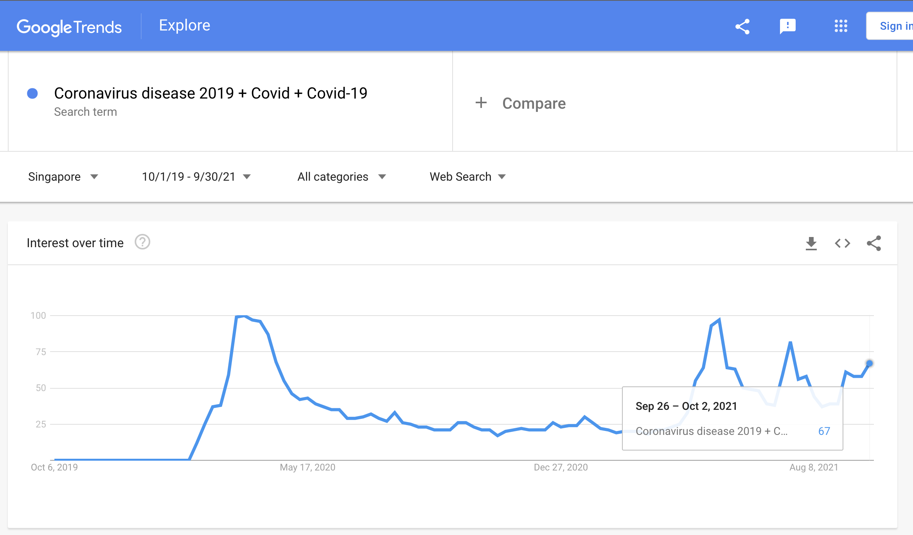

## Submission Instructions

- Select `output: html_document`.
- Include all code chunks, so include `echo=TRUE` in all chunk headers.
- Replace the placeholder text, "Type your answer here.", with the answer of your own.  (This is usually the descriptive and explanation part of your answer)
- Submit **only** the required question for grading (Question 2: Submission). You can delete everything else for that submission. Remember to include any `library('package_name')` statements that you'll need to run your code and future reproduction. 
- Rename your R Markdown file `T[X]_[MatricNumber].rmd`, and the output will automatically be `T[X]_[MatricNumber].html`.
    - for example, `T7_12345.html`
    - X is the Tutorial number at the top of this file. For example, this file is for "T7".
- Submit both R Markdown file (.rmd) and HTML (.html) to Luminus for tutorial assignments (upload to Luminus under the correct Submission Folder). 
- **It is important to be able to code and produce your Rmarkdown output file *independently*.** 

## Tutorial 7: Time Series Forecasting

```{r load-libraries, echo=TRUE, message=FALSE}
# intall required packages if you have not (suggested packages: rcompanion, rstatix, Rmisc, dplyr, tidyr, rpivotTable, knitr, psych)
# install.packages("dplyr") #only need to run this code once to install the package
# load required packages 
# library("xxxx")

library(dplyr)
library(tidyverse)
library(ggplot2) 
library(TTR)


```


## Tutorial 7 Question 1 Time-series Basics
### (To be discussed in Tutorial 7 (the week of 11 Oct - 15 Oct))

- Dataset required: `Tutorial7_SingStat_HDBPrices.csv`

Note: This dataset comes from publically available data from the Singapore Department of Statistics, or SingStat. https://data.gov.sg/dataset/hdb-resale-price-index. 

First, load in the dataset for this question. There is only one variable, which is the average HDB resale price index. Q1 of 2009 is set as the "base" period, and thus has by definition an index value of 100. The index values of the rest of the years are relative to this base value (so a value of 120 means that the average HDB resale price index for that quarter is 120% (or 1.2x) that of the index of Q1/2009).

The code below will also "hold out" Years 2018 and 2019, to test the predictions of our model. This means that we fit the model using all the years except 2018 and 2019, and then once we have the fitted model, we see how well it does on 2018 and 2019.

```{r q1-read-in-dataset, echo=TRUE}
d1_wide = read.csv('Tutorial7_SingStat_HDBPrices.csv', header=T, na.strings = "NA")
View(d1_wide)

# removing unused columns
d1_wide_HELDOUT = d1_wide[,114:119] # HOLDING OUT values in 2018 and 2019
d1_wide = d1_wide[,2:113] # keeping values up to and including 2016

# convert to a `ts` object:
d1_ts = ts(unlist(d1_wide[1,1:ncol(d1_wide)], use.names=F), 
           frequency=4, 
           start = c(1990, 1))

```


```{r q1-read-in-dataset2, echo=TRUE}

# also create a long form data frame. If you are interested in learning more about dplyr, try understanding what each step in this code does by running each line separately (without the last %>%), and inspecting the resulting file using head(d1_long)

d1_long = d1_wide %>% 
  # gather() converts wide-form to long-form. 
  gather(key="YearQuarter", value="PriceIndex") %>%
  # remove the annoying "X"
  mutate_at("YearQuarter", function(x) {sub(pattern="X", replacement="", x)}) %>% 
  # split "YearQuarter" into a "Year" variable and a "Quarter" variable
  # and make a variable called "TimeIndex" that just goes 1, 2, 3, 4...
  mutate( Year = as.numeric(substr(YearQuarter, start=1, stop=4)),
          Quarter = substr(YearQuarter, start=6, stop=7),
          TimeIndex = 1:length(YearQuarter)) %>%
  # Rearrange the columns in a nicer order
  select("TimeIndex", "YearQuarter", "Year", "Quarter", "PriceIndex")
```


Q1a) First, plot the data. There is only one variable, so just plot this against time on the horizontal axis. What do you notice? (Stationary? Trend? Seasons? Cycles?)

<p style="color:red">**BEGIN: YOUR ANSWER**</p>

```{r q1a-plot, echo=TRUE}
plot(d1_ts)
```


<p style="color:blue">
Please type your answer here.
</p>

<p style="color:red">**END: YOUR ANSWER**</p>


Q1b) Calculate a Simple Moving Average model to the data, using the Equation we had in class, where 
$\hat{Y}_{t+1} = \frac{1}{k} \left(Y_t + Y_{t-1} + \ldots + Y_{t-(k-1)} \right)$

Calculate one with window size of 4 periods (1 year). Calculate a second one of 16 periods (4 years). Plot these two (and the actual data) on the same plot. Discuss what you see.

<p style="color:red">**BEGIN: YOUR ANSWER**</p>

```{r q1b-sma, echo=TRUE}
d1_long

d1_long$SMApred4 = dplyr::lag(SMA(d1_long$PriceIndex, n=4), 1)
d1_long$SMApred16 = dplyr::lag(SMA(d1_long$PriceIndex, n=16), 1)

ggplot(d1_long, aes(x=TimeIndex)) +
  geom_line(aes(y=PriceIndex, color = "Raw")) +
  geom_line(aes(y=SMApred4, color = "Window4")) +
  geom_line(aes(y=SMApred16, color = "Window16")) +
  scale_color_manual(name = "Legend", values = c("Raw" = "black","Window4" = "blue", "Window16" = "green")) +
  theme_bw()

```

<p style="color:blue">
Please type your answer here.
</p>


Q1c) Based on what you observed about the time-series in Q1a, fit a HoltWinters model to the data. Use the model to predict the next 6 periods (6 quarters), and plot the predictions.

<p style="color:red">**BEGIN: YOUR ANSWER**</p>

```{r q1c-holtwinters, echo=TRUE}
# fit the model
hw1 = HoltWinters(d1_ts, gamma = FALSE)
hw1

# predict by using the trained model
hw1_predict = predict(hw1, n.ahead = 6)

# plot the prediction
plot(hw1_predict)

# plot the training data and prediction together
plot(hw1, hw1_predict)

```

<p style="color:blue">
Please type your answer here.
</p>


Q1d) Compare the HoltWinters model's (Q1c) predictions with `d1_wide_HELDOUT`, which contains the actual values for 2018/2019. (Hint: use `XXX[1:Y]` to extract the first few values from the `predict` object). 

What is the mean sum of squared error for these 6 predicted data points? Take the square root of that, which gives the root-mean-squared-error, or RMSE. Report the RMSE.

$RMSE = \sqrt{\frac{1}{n}\sum_i(\hat{y}_i-y_i)^2}$

Make a plot of the Holt-Winters predictions and the actual values in `d1_wide_HELDOUT`, both on the y axis and with time on the horizontal axis. Use colors and/or linetypes to differentiate, and include a legend.

(Bonus: why did I not ask you to use the Simple Moving Average model to forecast the held-out dataset?)


<p style="color:red">**BEGIN: YOUR ANSWER**</p>


```{r q1d-holtwinters-rmse-plot, echo=TRUE}
# prediction values
class(hw1_predict)
hw1_predict[1:6]

# actual values
class(d1_wide_HELDOUT)
as.numeric(d1_wide_HELDOUT)

# RMSE
sum_squared_errors_hw1 = mean((hw1_predict[1:6] - as.numeric(d1_wide_HELDOUT))^2)
RMSE_hw1 = sqrt(sum_squared_errors_hw1)

print(c(sum_squared_errors_hw1, RMSE_hw1))
```

```{r visualization, echo=TRUE}
# visualization
plot(1:6, hw1_predict[1:6],
     type = "l", col = "blue",
     ylim = c(min(hw1_predict[1:6]), max(hw1_predict[1:6])), 
     xlab = "Time",
     ylab = "Price"
     )
lines(1:6, as.numeric(d1_wide_HELDOUT), type = "l", col = "darkgreen")
legend(x=4.5, y=132,
       legend = c("Holt-Winters", "Actual"),
       col = c("blue", "darkgreen"),
       lty = 1
       )
```


<p style="color:blue">
Please type your answer here.
</p>

<p style="color:red">**END: YOUR ANSWER**</p>


#### Q1e) 

For the second-half of this question we shall be using a dataset that's available in R. Load in the dataset using `data(ChickWeight)`. The dataset will then be stored in a variable called `ChickWeight`

There are 4 variables in this long-form dataset, with 578 observations, that comes from a longitudinal experiment in which chicks (baby chickens) were given different types of diets since birth, and the chicks' weights were measured at various time-points. The variables are:

- `weight`. Body weight of the chick at that time point (in grams).
- `Time`. A numeric variable, measuring days since birth at the time of weight measurement. 
- `Chick`. A `factor` that represents a unique Chick. There are in total 50 unique chicks.
- `Diet`. A `factor` with levels 1,2,3,4 that represents the diet that the chicks were fed.

```{r q1e-read-in-data, echo=TRUE}
data(ChickWeight)
head(ChickWeight)
View(ChickWeight)
```


First, let's plot some time-series data. Plot the weight-vs.-time graphs for Chick numbers: `3, 20 and 24`. Put them all on the same graph, make sure each `Chick`'s data is connected by a line, and label each line accordingly.

Which diet did each of these 3 chicks take?

<p style="color:red">**BEGIN: YOUR ANSWER**</p>


```{r q1e-plot, echo=TRUE}
# get the dataframe of the 3 chicks
three_chicks = ChickWeight %>% filter(ChickWeight$Chick %in% c("3", "20", "24"))

# visualization
ggplot(three_chicks, aes(x = Time, y = weight, group = Chick, color = Chick)) +
  geom_line() +
  theme_bw()
``` 

<p style="color:blue">
Please type your answer here.
</p>

<p style="color:red">**END: YOUR ANSWER**</p>

#### Q1f) 

From Q1e, you can already see that (i) there is a lot of individual variation between chicks with the same diet, and (ii) there may be differences across diets. Of course, we just took three chicks to plot, so we can't draw any conclusions just like that. 

Make a subset of all the chicks that took `Diet 3`. For this subset, fit a linear model predicting `weight` just using `Time`. This is a regression-based time-series model where our predictor, our "X", is just an index now that represents time. Interpret the intercept and slope coefficients.


<p style="color:red">**BEGIN: YOUR ANSWER**</p>

```{r q1f-model, echo=TRUE}
chick_diet_3 = ChickWeight %>% filter(ChickWeight$Diet == "3")

# linear model
summary(lm(chick_diet_3$weight ~ chick_no_3$Time))
```
(Challenge: Try to plot all the `Chick`s on this diet on the same plot. Make sure each line corresponds to one `Chick`.)

```{r draw all chicks on diet 3}
ggplot(chick_diet_3, aes(x = Time, y = weight, group = Chick, color = Chick)) + 
  geom_line() + 
  theme_bw()
```


<p style="color:blue">
Please type your answer here.
</p>


<p style="color:red">**END: YOUR ANSWER**</p>


#### Q1g) 

Now let's look at two groups. Make a subset of `Chicks` who are on `Diet 3` and `Diet 1`. Make a dummy variable to indicate which `Diet` they are on. (To give you some practice in manipulating variables, let's say that 3 is the reference group, and this dummy variable should be 1 if the Chick is on Diet 1 and 0 if the Chick is on Diet 3).

If I'm interested in seeing whether the `Diet` affects `Chicks`' growth, what is the linear regresion model I should test? Run this model, and interpret the coefficients on the variables in the model. Which of the two `Diet`s seem to be better for growth?


<p style="color:red">**BEGIN: YOUR ANSWER**</p>

```{r q1g-model, echo=TRUE}
# get the dataframe
chick_diet_1_3 = ChickWeight %>% filter(ChickWeight$Diet %in% c("1", "3")) %>% 
  mutate(Dummy = factor(Diet, levels = c("3", "1"), labels = c(0, 1)))

summary(lm(weight ~ Time*Dummy, data = chick_diet_1_3))

```
(Challenge: Try to plot all the Chicks in this analysis on the same plot. Similar to 1f, make sure each Chick corresponds to one line. But for this graph, let's color the lines by Diet. This may help you to visualize the coefficients you see in the model.)
```{r visualization, echo=TRUE}
ggplot(chick_diet_1_3, aes(x = Time, y = weight, group = Chick, color = Diet)) + 
  geom_line() + 
  theme_grey()

```


<p style="color:blue">
Please type your answer here.
</p>


<p style="color:red">**END: YOUR ANSWER**</p>

#### Q1h)

Finally, let's look at all four `Diet`s. This last part is building up from the previous sub-parts. You already know enough to do this, you just have to be very careful in interpreting each step.

Now, let's use the full dataset. `ChickWeight$Diet` is already a factor, so let's just use `Diet` as the moderator, and see if `Diet` moderates growth rates. You should be running the same `lm()` model 

What is the reference group of: `ChickWeight$Diet`?

How do you interpret each interaction coefficients?


Which seems to be the best `Diet` for growth (i.e., with the highest growth rate)? Which seems to be the worst?


(challenge points for plotting all these results. One way I would recommend visualizing them is putting all the `Chick`s in one `Diet` on one graph, and have four graphs side-by-side. If you use ggplot it's called facet-ing. Your tutor will show this graph in class using `ggplot`, but I will leave this as a bonus challenge for you.)


<p style="color:red">**BEGIN: YOUR ANSWER**</p>


```{r q1h-model, echo=TRUE}
summary(lm(weight ~ Time*Diet, data = ChickWeight))
```
```{r}
ggplot(ChickWeight, aes(x = Time, y = weight, group = Chick, color = Chick)) + 
  geom_line() +
  facet_grid(~Diet) + theme_bw() #+ theme(legend.position = "None")
```

<p style="color:blue">
Please type your answer here.
</p>


<p style="color:red">**END: YOUR ANSWER**</p>


Footnote: Actually, the proper way to handle a longitudinal dataset like this involves being able to handle **repeated measures**. Each chick appears multiple times in the dataset (hence, **measurements** are **repeated** on individuals), and we have not really accounted for that. This affects degrees of freedom, since you need to estimate intra-individual effects as well as inter-individual effects. This is something out of the scope of this introductory course, called multilevel modelling, or alternatively, linear mixed-effects modelling. In this question, we have ignored all of that. For those who are interested, a common approach to model this dataset "more properly" uses a function called `lmer()` from the `lme4` package, that has very similar syntax to `lm()`. 


## Tutorial 7 Part 2: For Submission
## Question 2 
### (To be submitted by 18 Oct 8am, 20 marks)

In today's tutorial we will be combining data from two public sources. 

The first is: a large public and continually updated dataset on Covid-19, called the *Our World in Data* COVID-19 Dataset. https://github.com/owid/covid-19-data/tree/master/public/data. This dataset is updated daily, and so we have done some processing to select a subset of the data for this tutorial. 

- We are interested in the number of Covid-19 cases in Singapore as a function of time. The data begins on 23 January 2020 (and we assume that there are 0 cases before that). 
- `location`: Singapore
- `date`: Date of observation
- `new_cases_smoothed_per_million`: New confirmed cases of COVID-19 per 1,000,000 people, smoothed over the past 7 days. That is, an entry for 2020-01-23 would give the average of the week ending on 23 January 2020.


The second dataset comes from Google Trends (https://trends.google.com/). Google Trends allows you to see how popular search queries are, and you can refine your search by Date as well as by Geographic Region. Here, we will be concentrating on how much people searched for Covid-19, from the 2 years of 6 October 2019 till 2 October 2021. How you can obtain this dataset (and )

- using the Google Trends API, search for "Coronavirus disease 2019 + Covid + Covid-19"
- set location: Singapore. 
- set Dates to 10/1/19 to 9/30/21 (American style dates). See screenshot below.

The second dataset, Google Trends, has two (renamed) variables:

- `date`: Date of observation
- `search_vol`: Search volume for the week starting on `date`. 
    - That is, an entry for 2021-09-26 gives the search volume of the week beginning September 26 and ending October 2.
    - `search_vol` is normalized such that the maximum value in this range is 100, and that numbers from 0-100 indicate what was the fraction of search volume in that week. That is, a week that has a score of 80 will have double the number of searches as compared to a week that has a score of 40.
    - additional information from the Google tooltip: "Numbers represent search interest relative to the highest point on the chart for the given region and time. A value of 100 is the peak popularity for the term. A value of 50 means that the term is half as popular. A score of 0 means there was not enough data for this term."


See the screenshot below, which indicates that for the period of Sep 26 to Oct 2, there is a normalized search index of 67. (You can verify that this is the value in the dataset on this date)




The code below will read in the two datasets and do some simple munging for you.

```{r prepping-covid-dataset, echo=T, eval=T}
# Prof's code to prep the dataset
trends_data <- read.csv('Tutorial7-trends-2019-10-01-to-2021-09-30-SG.csv', skip=1) %>% 
  rename(date = Week,
         search_vol = Coronavirus.disease.2019...Covid...Covid.19...Singapore.) %>%
  mutate(date = as.Date(date))


covid_full <- read.csv('Tutorial7-owid-covid-data-2021-10-08.csv')

covid_subset <- covid_full %>% mutate(date = as.Date(date)) %>%
  filter(location %in% c("Singapore"),
         date %in% trends_data$date) %>% ### This step is to pick the same "Date" values as in trends_data
  select(location, date, new_cases_smoothed_per_million)
```


### Q2a)

In this question we will learn how we can use search engine trends to gain a little bit of insight. The first dataset, `covid_subset`, contains the number of new cases of Covid-19 in Singapore, while the second dataset, `trends_data`, contains the volume of Google searches originating from Singapore that contain the terms "Covid", "Covid-19", or "Coronavirus Disease 2019".

First, however, we have a little bit of an issue. Based on the documentation above, the `new_cases_smoothed_per_million` and the `search_vol` variables are not aligned (they are for different date ranges). 

Please add the `search_vol` variable from the `trends_data` dataframe into the `covid_subset` dataframe, and please adjust the `search_vol` variable accordingly so that the data is aligned. (Note that even after you adjust the variable, we may still be off by 1 day or so, please ignore this.) 

Please include a short written explanation to explain what the issue is, and what you did to fix it. 

Note that this problem often occurs in real life, because datasets may sometimes come with slightly different definitions for dates, so whenever we're dealing with multiple datasets we have to worry about how to correctly merge, or combine them.

[3 marks]


<p style="color:red">**BEGIN: YOUR ANSWER**</p>

<p style="color:blue">
Type your answer here.
</p>

<p style="color:red">**END: YOUR ANSWER**</p>


### Q2b)

Great, let's look at the data. Please provide a line plot of the two variables, the (adjusted) search volume, and the number of covid cases, on the same graph. Make sure your graph has a legend so that we can tell the graphs apart!

Overall, do either of the two graphs show (i) trends, (ii) seasonality, and/or (iii) cycles? Please discuss.


[7 marks]


<p style="color:red">**BEGIN: YOUR ANSWER**</p>

<p style="color:blue">
Type your answer here.
</p>

<p style="color:red">**END: YOUR ANSWER**</p>


### Q2c)


If we consider the two graphs from about January 26, 2020 till July 26, 2021 (the first few months of the pandemic), what do you notice? Does it seem like one variable is leading the other variable? If so, which is leading, and why do you think so (i.e., offer some interpretation as to why one may be leading the other, or not)?

What about during the period from July 4, 2021 until September 5, 2021? Does it seem like one variable is leading the other variable? If so, which is leading, and why do you think so (i.e., offer some interpretation as to why one may be leading the other, or not)?


(You may make new plots if it helps you to discuss).

[This part is not graded] By the way, you may notice there's a peak in Google searches from Singapore in the period May 2021 till mid June 2021, but there's no corresponding changes in Covid-19 cases (at least, at this scale). This roughly corresponds to when Singapore reverted to "Phase 3 / Phase 2 Heightened Alert", starting 8 May 2021 and going back and forth Phase3/Phase2 until August... Food for thought to discuss with your classmates why you think this behavior shows up in the Google search data.

[6 marks]


<p style="color:red">**BEGIN: YOUR ANSWER**</p>

<p style="color:blue">
Type your answer here.
</p>

<p style="color:red">**END: YOUR ANSWER**</p>


### Q2d)

Finally, please use the search volume variable as a regressor to predict the number of new cases, across the entire range of the data. Please interpret the coefficients and what they mean.

(Not graded, but food for thought: what are some limitations of this linear model, given what you've observed about the data from a-d?)

[3 marks]

<p style="color:red">**BEGIN: YOUR ANSWER**</p>

<p style="color:blue">
Type your answer here.
</p>

<p style="color:red">**END: YOUR ANSWER**</p>


### Q2e)

[1 mark for submitting a html.]


******** ----------


